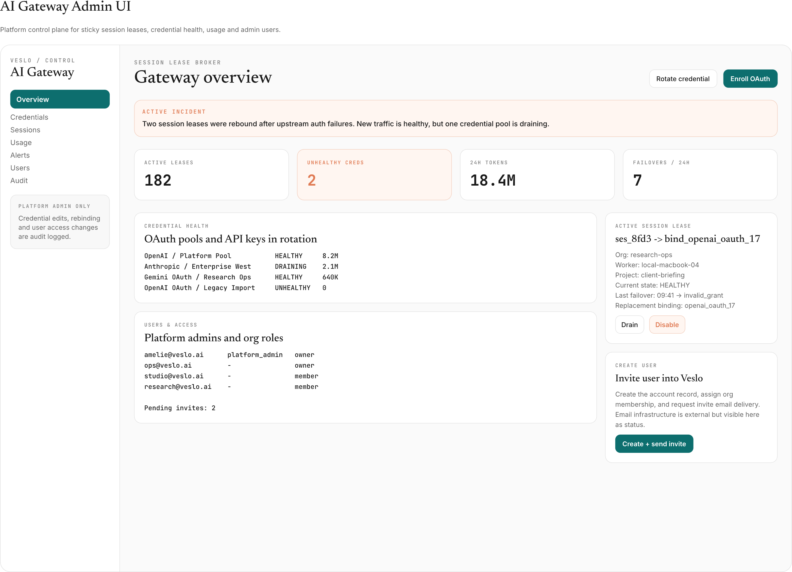
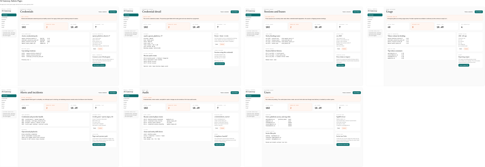

# AI Gateway Credential Broker Design

**Date:** 2026-03-29  
**Status:** Approved  
**Branch:** main

## Goal

Add a standalone cloud service that keeps AI provider secrets fully server-side, provides provider-compatible pass-through inference endpoints, pins credentials to a session-scoped lease, supports failover when a credential breaks, and exposes an internal admin control plane for credentials, usage, alerts, and user access.

## Scope

- Standalone `AI Gateway + Lease Broker + Metering` service deployed separately from the rest of Veslo.
- Central custody for AI provider API keys and OAuth credentials.
- Session-scoped sticky credential leases with controlled failover.
- Token metering per user, session, org, credential, and provider/model.
- Credential health tracking, alerting, reporting, and auditability.
- Internal admin web UI for platform operators.
- User directory and invite flow entry points inside the admin control plane.

Out of scope:

- Customer-hosted/local-model mode.
- Detailed credential assignment policy.
- Email delivery infrastructure details.
- Billing-grade provider-reported usage implementation details.
- End-user UI for this system.

## Validated Product Decisions

1. Threat model is effectively enterprise-grade: provider secrets must not be recoverable from the client machine.
2. Sending provider secrets to the client, even encrypted, is not acceptable.
3. Veslo Cloud is the only target for this system; customer-hosted runs local models and does not use this cloud credential layer.
4. The client-facing surface should remain provider-compatible and pass-through oriented.
5. Credential assignment must be stable within a session, not per worker and not permanently per user.
6. A single user may receive different credentials in different sessions or at different times.
7. A session should stay on one active credential binding until that binding becomes unhealthy.
8. If the active credential breaks, the session must fail over to a replacement credential instead of failing permanently.
9. Token metering is required per user and per credential/API key/OAuth grant.
10. The service must be observable from day one, with reporting, dashboards, and fast alerting.
11. The admin control plane should be separate from the main product UI and accessible only to platform admins.
12. The system must reflect current role reality in code: organization roles are `owner/member`, and global control-plane access is a separate `platform_admin` role.

## Existing Role Model in Code

The current backend already distinguishes between organization roles and global platform access:

- `owner` / `member` org roles are defined in `services/den/src/db/schema.ts`.
- `platform_admin` is a separate global role in `services/den/src/db/schema.ts`.
- Org access checks treat `owner` as the higher org privilege and allow `platform_admin` to bypass org-level role requirements in `services/den/src/http/org-auth.ts`.
- Current org member management in `services/den/src/http/orgs.ts` only works for already-existing users and does not yet implement a real invite flow.

Design implication:

- Main Veslo product continues to use `owner/member` inside organizations.
- The new AI gateway admin UI is reserved for `platform_admin`.
- The admin UI still needs a global user directory view and invite/create-user entry points.

## Approaches Considered

### 1) Central pass-through AI gateway with server-side credential broker (chosen)

- All client inference traffic goes to Veslo.
- Provider secrets stay in the cloud.
- Gateway resolves the active credential binding for each session and injects upstream auth server-side.

Pros:
- Satisfies the threat model cleanly.
- Cleanest audit, rate-limit, health, and failover boundaries.
- Preserves provider-compatible client behavior.

Cons:
- Becomes a critical path for latency and availability.
- Operationally more complex than direct provider access.

### 2) Local relay + cloud auth broker

- Client keeps talking to a local server that tunnels to cloud.

Pros:
- Smaller migration if local API surfaces must stay stable.

Cons:
- Does not materially improve security versus the central gateway.
- Adds another hop and more operational complexity.

### 3) Per-request dynamic credential selection

- Resolve a credential fresh for every request.

Pros:
- Flexible routing.

Cons:
- Violates the requirement for session stability.
- Makes upstream identity change too often.

## Recommended Architecture

Introduce a standalone cloud service with these core parts:

- `Veslo AI Gateway`
  - Provider-compatible pass-through inference endpoints.
- `Session Lease Broker`
  - Resolves and stores `session_id -> active_binding_id`.
  - Ensures sticky session behavior and atomic failover.
- `Credential Resolver`
  - Chooses candidate credential sets.
  - Assignment policy remains pluggable and can stay unspecified for now.
- `Token Broker`
  - Retrieves API keys or refresh tokens from secure storage.
  - Refreshes access tokens server-side when needed.
- `Secret Vault`
  - Holds API keys, OAuth client secrets, and refresh tokens.
- `Credential Health Store`
  - Tracks credential state (`healthy`, `degraded`, `unhealthy`, `revoked`, `draining`).
- `Usage Metering`
  - Records usage events and aggregates them across multiple dimensions.
- `Audit + Alerting`
  - Records sensitive actions and produces operational signals.

## Session Lease Model

The key abstraction is not `user -> credential`.

It is:

- `session -> logical lease -> active binding -> credential record`

Design rules:

- A session receives a logical lease when it starts or on its first routed inference request.
- The logical lease points to one active binding.
- The active binding points to one concrete credential record or OAuth grant.
- The session stays sticky to that binding while it remains healthy.
- If the binding fails permanently, the lease is rebound to a new binding.
- After rebinding, the session becomes sticky to the replacement binding.

This gives stable upstream identity inside one session, but still allows a different credential set in a later session for the same user.

## Credential Lifecycle and Failover Semantics

Three cases must be treated differently:

### 1) Refreshable auth issue

Examples:

- access token expired
- provider access token needs refresh

Behavior:

- do not change the session binding
- refresh the same underlying grant server-side
- retry the request once

### 2) Permanent credential failure

Examples:

- `invalid_grant`
- revoked refresh token
- invalid API key
- permanently unauthorized credential
- hard quota stop on that credential

Behavior:

- mark the current binding or credential as unhealthy/draining
- atomically rebind the session lease to a replacement credential
- retry using the new binding

### 3) Transient upstream failure

Examples:

- timeout
- provider 5xx
- brief rate-limit spike
- temporary network fault

Behavior:

- retry/backoff first
- do not immediately switch credentials
- only fail over after clear classification that the credential itself is broken

Concurrency rule:

- Failover must be `single-flight` and atomic for a session.
- Multiple parallel requests must not cause multiple competing rebindings.

## Request Flow

1. Client sends an inference request to `Veslo AI Gateway` with authenticated Veslo context and a `session_id`.
2. Gateway asks `Session Lease Broker` for the active lease binding.
3. If the session has no lease yet, the broker asks `Credential Resolver` for a candidate and creates the initial binding.
4. Gateway asks `Token Broker` for a valid upstream auth artifact for that binding.
5. Gateway sends the upstream request to the provider.
6. On success:
   - record usage
   - keep the same binding
7. On failure:
   - classify the failure
   - refresh the same binding if possible
   - otherwise perform atomic rebinding if the credential is unhealthy
   - retry only within strict bounded rules

## Metering and Usage Accounting

Token accounting is a first-class concern of the service.

Each usage event should carry at least:

- `request_id`
- `user_id`
- `org_id`
- `session_id`
- `worker_id`
- `project_id` or workspace context
- `credential_binding_id`
- `credential_record_id`
- `provider`
- `model`
- `prompt_tokens`
- `completion_tokens`
- `total_tokens`
- `started_at`
- `finished_at`
- `usage_source`
- `rebinding_occurred`
- `previous_binding_id` when applicable

Required aggregation dimensions:

- per user
- per session
- per org
- per credential/API key/OAuth grant
- per provider/model
- per time window

Important constraint:

- The design must be ready to incorporate provider-reported authoritative usage later.
- The exact provider-reported usage integration is deferred.
- In early versions, usage capture may use the gateway’s available usage payloads or estimations, but the architecture must leave room for authoritative reconciliation.

## Deployment Model

The service should run as a separate deployable unit:

- separate Docker/service or separate VM
- its own runtime and scaling policy
- its own storage for leases, credential health, and usage events
- vault/KMS kept outside the service process

Recommended topology:

- stateless gateway instances
- shared Postgres/Redis for lease state and single-flight locking
- secure vault/KMS for long-lived secrets
- append-only usage event log plus aggregation jobs/materialized reporting

Rationale:

- cleaner trust boundary
- simpler operations and incident ownership
- avoids coupling inference traffic to the main app/backend runtime

## Observability, Reporting, and Alerting

This is not optional infrastructure. It is part of the product boundary.

The service needs three visibility layers:

### Operational health

- availability
- p95/p99 latency
- request volume
- error rate
- failover count

### Credential health

- refresh failures
- auth failures
- unhealthy/draining/revoked credentials
- credential pool exhaustion by routing segment

### Usage visibility

- usage per user
- usage per session
- usage per credential
- usage per org

Recommended alerts:

- sudden spikes in `401/403/invalid_grant`
- credential pool exhaustion
- failover storms
- provider outage patterns
- metering gaps
- gateway unavailable/degraded
- latency regression

Recommended dashboards:

- provider dashboard
- credential dashboard
- user/session usage dashboard
- incidents dashboard
- audit timeline

## Admin Control Plane

The service includes an internal admin web UI for platform operators.

This UI is not end-user facing.

### Access model

- only `platform_admin` can enter the control plane
- regular users and org owners/members do not access it directly
- all destructive actions are audit logged

### Core screens

- `Overview`
  - gateway health
  - active lease counts
  - unhealthy/draining credentials
  - alert summary
  - top usage numbers
- `Credentials`
  - list of API keys and OAuth grants
  - health, lease count, last refresh/failure
- `Credential Detail`
  - refresh history
  - failover history
  - token usage through that credential
  - actions such as rotate, disable, drain, revoke
- `Sessions / Leases`
  - session lookup
  - current binding
  - rebinding history and reasons
- `Usage`
  - per user/session/credential/org views
- `Alerts / Incidents`
  - live credential and provider incidents
- `Audit`
  - all sensitive changes and rebinding history
- `Users`
  - global user directory
  - platform-admin status
  - org role visibility
  - invite/create-user entry points

### Users and invite handling

The admin UI must show all users, not only admins.

It should support:

- user directory listing
- showing platform-admin status
- showing org memberships and roles (`owner/member`)
- creating or inviting a user
- disabling a user
- resending an invite

The actual email transport is out of scope here, but the control plane should expose the operational states:

- `user created`
- `invite token generated`
- `invite email requested`
- `invite accepted`

## Pencil UI Mockup

An admin control-plane mockup was produced in Pencil and exported as:

The expanded multi-page board covering all approved control-plane pages was also exported as:

The mockup emphasizes:

- left navigation for major control-plane surfaces
- top health and incident visibility
- credential health and usage area
- sticky lease detail with rebinding context
- user directory and invite actions

## Security Invariants

- Provider secrets never leave server-side trust boundaries.
- Clients never receive provider API keys or refresh tokens.
- Sessions use one active binding at a time.
- Binding changes are exceptional, classified, and audit logged.
- Long-lived secrets remain in secure storage only.
- Admin control plane access is limited to `platform_admin`.

## Testing Strategy

### Unit tests

- lease creation
- sticky lease reuse
- refresh vs rebinding classification
- single-flight failover locking
- health transitions
- usage aggregation logic

### Integration tests

- full request flow through gateway
- session lease creation and reuse
- failover after broken credential
- per-user and per-credential usage recording
- admin UI access gating
- user creation/invite state transitions

### Manual verification

- simulate expired access token and confirm same-binding refresh
- simulate revoked credential and confirm atomic rebinding
- simulate provider outage and confirm retry without unhealthy rebinding storm
- confirm alerts trigger quickly for broken credential pools

## Recommended Implementation Summary

Build a standalone cloud `AI Gateway + Session Lease Broker + Metering` service with provider-compatible pass-through endpoints, session-scoped sticky credential leases, controlled failover, strong observability, and a platform-admin-only control plane. Reflect existing product roles exactly as they exist in code today: `owner/member` for organizations and `platform_admin` for global control-plane access.
