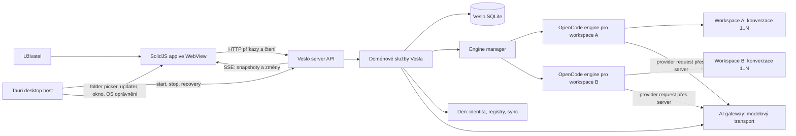

# Cílová architektura Vesla po revalidaci

Datum: 2026-07-30

Stav: návrh k architektonickému schválení

Rozsah: lokální desktopový runtime, Veslo server, OpenCode engine, konverzace, běhy, události, workspace skills a cloudová brána

## 1. Proč tento dokument vzniká

Původní analýza v `docs/prestavba` správně pojmenovala hlavní problém Vesla: stejný proměnlivý stav má několik vlastníků a mezi UI, Tauri, serverem, orchestrátorem a OpenCode existují paralelní cesty. Od jejího vzniku se však změnily runtime kontrakty a některá produktová rozhodnutí. Tento dokument proto není pokračováním původního plánu po balíčcích. Popisuje nově revalidovaný cílový stav, ke kterému lze migrovat po menších, samostatně ověřitelných krocích.

Dokument respektuje současné základní rozhodnutí: autoritativní aplikací je Tauri desktop pro Windows a macOS. HTTP API není argument pro browser-first produkt; je to čistá interní hranice, díky které lze backend ověřit bez UI a později připojit další klienty bez kopírování doménové logiky.

## 2. Výsledek v jedné větě

**Jeden desktop host spouští jeden Veslo server; Veslo server vlastní workspaces, konverzace, run lifecycle, queue, transcript a engine routing; každý aktivní workspace má nejvýše jeden OpenCode engine proces, který může současně obsluhovat více samostatných konverzací.**

OpenCode je execution engine, nikoli databáze nebo doménový model Vesla. SolidJS aplikace je projekce serverového stavu a vlastník uživatelského záměru, nikoli koordinátor lokálních procesů.

## 3. Cílová topologie



Normální lokální procesní model:

1. jeden Tauri desktop host;
2. jeden `veslo-server` proces;
3. nula až N OpenCode procesů, nejvýše jeden živý engine slot na workspace;
4. volitelné nástroje nebo MCP procesy spuštěné na požádání, ne jako povinné globální sidecary.

Samostatný orchestrátor nemá být trvalou veřejnou architektonickou vrstvou. Jeho engine pool, generation fencing, skill projection a recovery logika se mají stát interním modulem Veslo serveru. Do doby fyzického sloučení může proces zůstat implementačním detailem za privátním kontraktem, ale UI ani doménové služby nesmějí vědět, že existuje.

Messaging router, cloud workers a vzdálené execution topology nejsou součástí lokálního klientského jádra. Pokud se někdy vrátí jako produktová funkce, musí být připojeny jako klient Veslo API, ne jako druhý vlastník OpenCode sessions.

## 4. Vlastnictví stavu

Každý typ stavu musí mít právě jednoho autoritativního vlastníka.

| Oblast | Autoritativní vlastník | Ostatní vrstvy |
|---|---|---|
| Vybraný workspace, otevřený panel, draft, focus | SolidJS app | Pouze dočasný UI stav |
| Registr workspace a autorizované kořeny | Veslo server | Tauri pouze získá OS oprávnění a předá výsledek |
| Konverzace a vazba na OpenCode session | Veslo server | App zobrazuje projekci, OpenCode session je implementační reference |
| Run admission, queue, abort a terminální stav | Veslo server | Engine dodává evidence, app neposuzuje pravdu z jednotlivého eventu |
| Engine slot, process generation a routing | Engine manager uvnitř serverové hranice | Tauri dohlíží pouze na samotný Veslo server |
| Kanonický transcript pro Veslo UI | Veslo server read model | OpenCode je upstream zdroj eventů a recovery dat |
| Workspace config, skills, MCP a plugin projection | Veslo server | Engine dostává validovaný immutable runtime view |
| Přihlášení, organizace, registry a sync politika | Den | Lokální server drží jen potřebný lokální snapshot a vazby |
| Modelová autorizace a accounting konkrétního runu | Veslo server + AI gateway | Vstupní identita se váže při admission a dále se nemění |

UI selection nikdy nesmí přesměrovat existující run, změnit adresář konverzace ani restartovat engine jiného workspace. Přepnutí workspace znamená pouze změnu zobrazení.

## 5. Identity a jejich vztahy

Identity se nesmějí znovu slučovat do jednoho obecného `sessionId`.

```text
workspaceId
  ├─ engineSlotId                  stabilní logický slot workspace
  │    └─ engineOwnerId            unikátní process generation při každém spawnu
  └─ conversationId               stabilní Veslo konverzace
       ├─ opencodeSessionId        vazba na session konkrétního enginu/adresáře
       ├─ runId                    jeden konkrétní pokus o provedení
       └─ queueItemId
            └─ reservedRunId       budoucí run přidělený již při přijetí do queue
```

Závazná pravidla:

- `workspaceId` určuje datový a bezpečnostní scope, ne process generation.
- `engineSlotId` je stabilní slot pro workspace; `engineOwnerId` je nový náhodný generation token při každém spawnu.
- Owner musí být atomicky připojen k rezervaci před prvním upstream requestem. Selhání attachnutí je fail-closed.
- Engine-loss event smí ukončit pouze běhy se stejným `engineOwnerId`; starý callback nesmí poškodit novou generaci.
- `conversationId` patří právě jednomu workspace a jednomu kanonickému adresáři.
- `opencodeSessionId` je adapterová reference. Nesmí být hlavním routerem UI ani globálním klíčem bez workspace scope.
- V jedné konverzaci je nejvýše jeden aktivní run. Různé konverzace stejného workspace mohou běžet současně na společném enginu.
- `reservedRunId` je lifecycle identita od okamžiku přijetí queued sendu, ne pozdější UI detail.
- `engineSessionId` se nemá používat jako druhé jméno stejné hodnoty; na hranici migrace se převede na `opencodeSessionId` a poté odstraní.

## 6. Jeden workspace, jeden engine, více konverzací

Produkční default je `pooled-per-workspace`:

- první admitted run workspace líně vytvoří jeho engine slot;
- všechny konverzace workspace používají stejný proces, ale vlastní OpenCode session;
- server dovolí souběh napříč konverzacemi podle doložené kapacity enginu;
- queue je per conversation, nikoli globálně per workspace;
- abort konverzace A cílí na její přesný run a session a nesmí ukončit B;
- pád enginu uzavře nebo reconciliuje pouze runy připojené k jeho přesné generaci;
- nový engine nepřebírá nepotvrzené vlastníky staré generace.

Globálně sdílený OpenCode proces pro více workspace není normální topology. Může existovat pouze jako explicitní diagnostický režim. Dokud OpenCode nemá prokazatelně izolovanou per-directory konfiguraci, skills, pluginy, MCP a event routing, musí konflikt workspace view odmítnout místo last-writer-wins přepisu.

## 7. Příkazová a datová cesta

### 7.1 Zápisy

App posílá záměr přes workspace-scoped Veslo API. Neposílá raw engine URL, adresář, nový OpenCode session id ani owner generation.

Příklad send flow:

1. Composer vytvoří immutable draft snapshot a `clientMessageId`.
2. App zobrazí lokální echo a odešle Veslo submit intent.
3. Server ověří workspace, oprávnění, payload a attachmenty.
4. Server idempotentně materializuje konverzaci a OpenCode binding.
5. Server přijme run nebo ho uloží do per-conversation queue a přidělí `reservedRunId`.
6. Engine manager vybere či spustí workspace engine a připojí přesnou generation identity.
7. Teprve potom adapter odešle request do OpenCode.
8. Server ingestuje události a aktualizuje lifecycle i transcript read model.
9. App dostane změny přes SSE a nahradí local echo kanonickou projekcí.

Veškeré mutace `.opencode/`, workspace configu, skills, MCP a pluginů musí být vyjádřitelné přes serverové API. Tauri-only zápis je zakázaný, pokud nejde o OS capability, kterou server sám nemůže získat.

### 7.2 Čtení

App čte workspaces, konverzace, runs, queue a transcript z Veslo serveru. Přímý app import OpenCode SDK a přímé čtení `opencode.db` nejsou součástí cílové architektury.

Veslo server udržuje vlastní read model. OpenCode API může sloužit pro exact-session recovery a backfill, ale jeho SQLite schéma není kontrakt. Přímé SQL čtení ani zápis z Rustu, app nebo Veslo server domény se odstraní.

## 8. Eventy, SSE a recovery

App má jeden serverem vlastněný event transport. Server může interně konzumovat více OpenCode streamů, ale jejich raw eventy nepouští přímo do UI.

App-facing event envelope obsahuje minimálně:

```text
eventId
eventType
workspaceId
conversationId?
opencodeSessionId?
runId?
engineOwnerId?
bindingRevision?
payload
occurredAt
```

Pravidla:

- `Last-Event-ID` je kurzor serverového streamu, nikoli mechanismus session deduplikace.
- Deduplikace transcript partů a lifecycle změn používá jejich vlastní stabilní identity/revision.
- Neznámý session event se nepřiřadí jen podle aktuálně vybraného workspace. Musí existovat platný serverový binding nebo autorizovaný binding envelope; jinak se event odloží k reconciliation nebo odmítne.
- `session_idle` je evidence enginu, ne samo o sobě důkaz dokončení Veslo runu.
- Terminální stav vzniká z přesného run lifecycle a kanonické transcript evidence.
- Reconnect nejprve obnoví stream cursor, potom provede omezený catch-up jen pro známé aktivní běhy.
- Passive snapshot nesmí přepsat novější nebo bohatší live transcript.

Engine-loss komunikace mezi engine managerem a run lifecycle musí být idempotentní. Událost nese exact owner tuple a opakované doručení má stejný výsledek. Nedostupný příjemce událost neztratí: pending loss se uloží nebo je odvoditelný při startup reconciliation.

## 9. Idempotency a queue

`clientMessageId` je workspace-wide admission identita. Conversation musí být součástí request fingerprintu. Stejný `clientMessageId`:

- se stejným fingerprintem vrátí původní výsledek;
- s jiným payloadem nebo jinou conversation vrátí strukturovaný `409 idempotency_conflict`;
- po timeoutu nesmí vytvořit druhý run ani druhý queued item;
- po materializaci první konverzace musí retry znovu použít stejný target.

Queue evidence se při migraci vyhodnocuje podle stavu:

- `pending` a pre-dispatch `starting` lze bezpečně označit jako konflikt nebo vrátit do pending;
- `submitted` znamená skutečný upstream handoff a musí zachovat run i lifecycle vazbu;
- konflikt se může zaznamenat vedle skutečného handoffu, ale nesmí tvrdit, že práce nebyla odeslána.

## 10. Workspace skills a runtime projection

Veslo server vlastní inventář a policy. Engine nesmí přímo objevovat libovolné globální nebo projektové kořeny mimo efektivní manifest.

Pro každý workspace server sestaví immutable runtime projection:

```text
workspaceId
projectionRevision
contentDigest
allowed skill directories
agents / commands / modes
plugins
MCP configuration
provider and launch capabilities
```

Projection je připravena před admission runu a je připojena k engine generaci. Aktualizace skills nebo configu:

1. vytvoří novou revision mimo aktivní view;
2. atomicky ji publikuje;
3. buď bezpečně reloadne idle workspace engine, nebo změnu aktivuje až pro další generaci;
4. nikdy nemění obsah pod právě běžícím runem bez explicitního podporovaného reload kontraktu.

Praktický limit zobrazení workspace skills není počet otevřených konverzací. Deset konverzací jednoho workspace může sdílet jeden identický skill view. Limitem je počet současně rozdílných workspace projections, které musí být procesně izolované. V topology jeden engine na workspace je limit dán dostupnými procesy/pamětí, nikoli kolizí `skills.paths`.

Globálně sdílený engine má naopak bezpečný limit **jedna process-wide projection**, dokud není experimentálně doložena úplná directory-scoped izolace. Dva workspace s rozdílnými skills/configem musí být v takovém režimu odmítnuty nebo umístěny do oddělených shardů; nesmějí si přepisovat aktivní view.

Dashboard zobrazuje app-owned/server-backed inventory. Otevření session sidebaru nesmí spouštět úplný filesystem scan a send nesmí čekat na kosmetický refresh inventáře. Neplatná nebo kolidující konfigurace vrací strukturovanou chybu až do UI, včetně `409`, expected revision a observed revision.

## 11. Hranice Tauri desktopu

Tauri zůstává autoritativním runtime hostem, ale má úzkou odpovědnost:

- spustit, sledovat a obnovit jeden lokální Veslo server;
- předat server URL a krátkodobý client token app;
- folder picker a OS folder authorization;
- updater, okno, clipboard a další skutečně nativní capability;
- bezpečné ukončení lokálních procesů při shutdownu.

Tauri nemá vlastnit OpenCode session, transcript, run queue, workspace activation ani provisioning `.opencode/`. Nemá ani vytvářet druhou SSE interpretaci. Pokud server zemře, desktop obnoví server; doménovou recovery po restartu provede server z durable stavu.

Desktop zůstává hlavním integračním runtime a acceptance povrchem. Headless server-orchestrator testy dokazují backendovou cestu bez UI, ale nenahrazují desktopové ověření OS lifecycle, oprávnění a balených sidecarů.

## 12. Serverová vnitřní struktura

Jeden serverový proces neznamená jeden velký soubor. Cílové moduly mají jednosměrné závislosti:

```text
HTTP/SSE adapters
        ↓
application use-cases
        ↓
domain services and policies
        ↓
ports: repositories, engine, cloud, filesystem, clock
        ↓
adapters: SQLite, OpenCode HTTP, Den, AI gateway, local filesystem
```

Doporučené domény:

- workspace registry a authorization;
- conversation binding;
- submit/admission a idempotency;
- run lifecycle a durable queue;
- transcript ingestion/read model;
- engine management a generation fencing;
- runtime projection pro skills/config/MCP;
- managed AI authorization;
- diagnostics a audit events.

OpenCode adapter překládá Veslo příkazy a eventy do konkrétní verze SDK/API. OpenCode typy nesmějí protékat do domény ani frontendového kontraktu. Upgrade nebo výměna enginu se potom odehrává uvnitř adapteru a contract testů.

## 13. Co do cílového jádra nepatří

- přímé OpenCode SDK importy v UI;
- přímé SQL dotazy do `opencode.db`;
- samostatné registry workspace v app, Tauri, serveru a orchestrátoru;
- router nebo proxy, jejichž jedinou rolí je předat stejný request další vrstvě;
- Tauri IPC varianta každé serverové operace;
- browser-first fork aplikace nebo druhá doménová implementace pro web;
- globální busy/error stav pro workspace-scoped operace;
- automatické přiřazení neznámého eventu k právě otevřené session;
- process-wide skill/config přepis mezi různými workspace;
- povinně spuštěné pomocné sidecary, které lze spustit on-demand.

Document workflows mají být normální skills/tool capabilities za server-owned hranicí. Samostatný document-runtime proces má smysl pouze tehdy, pokud poskytuje nezastupitelnou izolovanou capability se stabilním API; nesmí se stát dalším vlastníkem session nebo transcriptu.

## 14. Pozorovatelnost

Jeden průchod musí být dohledatelný přes strukturované identity:

```text
traceId → workspaceId → conversationId → runId/reservedRunId
        → opencodeSessionId → engineOwnerId → providerRequestId
```

Logy nesmějí obsahovat tokeny ani celý citlivý prompt ve výchozím režimu. Každá mutace configu a runtime projection zapisuje audit event. Diagnostika musí umět odpovědět:

- který server a engine generation request obsloužily;
- jaká projection revision byla aktivní;
- proč byl run submitted, queued, blocked nebo failed;
- zda terminal vznikl z engine eventu, transcript evidence, abortu nebo engine loss;
- zda retry replayoval původní admission, nebo byl odmítnut jako konflikt.

## 15. Bezpečnostní pravidla

- Všechny lokální služby poslouchají pouze na loopback, pokud uživatel explicitně nezapne jiný režim.
- Každý app request používá serverem vydaný token; interní engine control transport má oddělené credentials.
- Workspace filesystem operace jsou omezené na normalizované autorizované kořeny.
- Cesty se porovnávají canonical/OS-aware způsobem, ale raw platform path zůstává pro skutečné otevření.
- Client nesmí zvolit organizaci, engine URL, directory ani generation pomocí důvěryhodně vypadajících hlaviček.
- Modelová autorizace se snapshotuje při run admission a během runu se nepřesměruje.
- Chybějící nebo nejednoznačný binding selže uzavřeně.

## 16. Ověřovací kontrakt cílové architektury

Architektura je prokazatelná, až když projde následující více-krokový runtime oracle bez UI:

1. spustí skutečný Veslo server a skutečný engine manager;
2. registruje jeden dočasný workspace;
3. založí deset různých konverzací;
4. odešle deset souběžných runů přes veřejné Veslo API;
5. prokáže deset rozdílných `conversationId`, `opencodeSessionId` a `runId` nad jedním `engineSlotId` a jedním aktuálním `engineOwnerId`;
6. abortuje jednu konverzaci a doloží pokračování ostatních;
7. shodí engine, spustí novou generaci a doloží, že opožděný loss callback staré generace neukončil nový run;
8. zopakuje submit se stejným a změněným fingerprintem a ověří replay versus `409`;
9. změní skill projection a ověří revision fence a absenci cross-workspace leakage;
10. restartuje Veslo server a ověří obnovu durable queue, bindings a transcript read modelu.

Desktop acceptance následně ověřuje start/recovery serveru, folder authorization, skutečný send a balenou runtime topologii v Tauri. Jednotkové testy zůstávají podpůrné pro generation fencing, idempotency a projekční policy; samy o sobě nenahrazují integrační průchod.

## 17. Doporučené pořadí migrace

1. **Zamknout kontrakt.** Schválit tento dokument, srovnat canonical docs a označit původní 50balíčkový plán jako historický.
2. **Stabilizovat důkazy.** Zprovoznit Quality, headless runtime oracle a malý desktop recovery gate.
3. **Uzavřít identity.** Dokončit generation owner, idempotency, lifecycle alias migration a event authorization envelope.
4. **Přesunout pravdu do serveru.** Odstranit app/Tauri lifecycle rozhodování a přímé OpenCode DB cesty.
5. **Sjednotit transport.** App používá Veslo HTTP/SSE kontrakt; Tauri IPC zůstane pouze pro nativní capabilities.
6. **Sjednotit backendovou runtime hranici.** Přesunout orchestrator moduly pod Veslo server a odstranit redundantní proxy/registry.
7. **Rozdělit god files podle domén.** Dekompozice následuje po stabilizaci ownershipu, aby pouze nerozložila stejný chaos do více souborů.
8. **Odstranit nepotřebné procesy a povrchy.** Router, mrtvé compatibility cesty a povinné on-start nástroje odstranit až s doloženým konzumentem a rollbackem.

Každý krok musí skončit funkční aplikací a jedním novým vynuceným invariantem. Nesmí vzniknout dlouhé období, kdy jsou stará i nová autoritativní cesta rovnocenné.

## 18. Rozhodnutí potřebná před implementací

Následující body musí vlastník produktu nebo architekt výslovně potvrdit:

1. Tauri desktop zůstává autoritativním produktem; HTTP je interní kontrakt a možnost budoucího klienta, nikoli okamžitý browser-first pivot.
2. Produkční topology je jeden engine na workspace a více konverzací na engine.
3. Orchestrator se dlouhodobě stává interním modulem Veslo serveru.
4. OpenCode zůstává, ale pouze za Veslo-owned adapterem bez přímého DB kontraktu.
5. Messaging router a remote execution nejsou součástí lokálního klientského jádra.
6. Document workflows se realizují přes skills/tool capabilities; případný runtime proces musí znovu prokázat potřebu.
7. Sandbox je volitelná execution policy nad stejným doménovým modelem, nikoli druhá architektura.

Po potvrzení těchto bodů má smysl odvodit nový krátký implementační plán. Původní odhad 50 balíčků a 69–92 sessions se nemá používat jako aktuální plánovací baseline.
