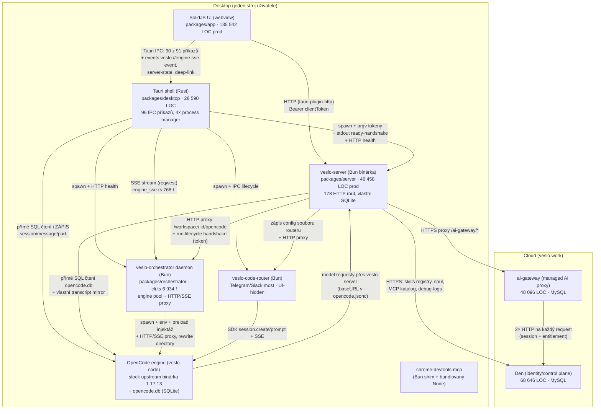

# SYNTÉZA — Závěrečný architektonický report Veslo

Datum: 2026-07-19 · Autor: hlavní architekt (syntéza 17 analytických reportů + doplnění mezer)
Zdroje: reporty v tomto adresáři (`app-jadro.md`, `app-integrace.md`, `app-komponenty.md`, `desktop.md`, `server.md`, `orchestrator.md`, `router.md`, `opencode-vazba.md`, `multi-workspace.md`, `git-historie.md`, `dokumentace.md`, `build-pipeline.md`, `den.md`, `ai-gateway.md`, `male-services.md`, `ostatni-balicky.md`, `doplneni.md`, `ipc-http-parita.csv`). Všechna čísla jsou ověřená na HEAD `main` (71215b07, 2026-07-19).

---

## 1. Skutečná architektura dnes

### 1.1 Mapa komponent a kanálů

Po startu desktopu běží **6 lokálních procesů** (Tauri shell + 5 sidecарů) a aplikace mluví se **2 cloudovými službami**. Jeden prompt uživatele projde **třemi HTTP proxy vrstvami za sebou** (opencode-vazba.md §3):

Kanály, které diagram nezachytí (desktop.md, opencode-vazba.md):
- **Soubory jako IPC**: dual provisioning `.opencode/` (TS `internal-system.ts` 1 243 ř. ↔ Rust `internal_provision.rs` 1 243 ř. — ručně zrcadlené dvojče), plugin-state soubor s tokeny, orchestrator `auth.json`/`state.json`, pending drafts, `opencode-managed-deps.json` (npm balíčky base64 v JSONu).
- **Procesní heuristiky**: zabíjení stale procesů podle jména/cwd přes `ps`/`pgrep`/`taskkill`, WSL bridge přes PowerShell (`veslo_server/mod.rs` 2 651 ř.).
- **Runtime hacky místo forku enginu**: preload zvedající `EventEmitter.defaultMaxListeners`, symlink `opencode`→`veslo-code` (engine se verifikuje přes `which opencode`), sync `opencode.json` do config diru **při každém mutujícím requestu** (orchestrator cli.ts:5459).

### 1.2 Kdo je zdroj pravdy o čem — a v čem je to rozbité

| Doména | Kolik „pravd" | Kde |
|---|---|---|
| Aktivní workspace | **4** | Solid signál v UI, Tauri `veslo-workspaces.json`, veslo-server (aktivace = reorder pole!), orchestrator state (dokumentace.md, třída A; potvrzeno živě auditem-3) |
| Registr workspace | **3** | Tauri veslo-state, orchestrator state JSON, veslo-server registr — synchronizace best-effort, chybový kód `workspace_registry_unsynced` je běžný provozní stav (app-integrace.md) |
| Transkript | **2** | engine `opencode.db` + host-side mirror ve veslo-server SQLite; smiřuje je `live-transcript-read-policy` + projection store (app-jadro.md §hotspot 4) |
| Run lifecycle | **3 vrstvy** | OpenCode SSE, server durable run (SQLite fronta + reconciler 1 654 ř.), FE optimistický stav — bez jednoho vlastníka (dokumentace.md, třída F) |
| Identita session | **3 jmenné prostory** | UI session id, Veslo `conversationId`, `opencodeSessionId` — každý lookup prochází množinu kandidátů (app-jadro.md) |
| Verze OpenCode | **5 pinů** | 2× package.json `opencodeVersion`, 2× `@opencode-ai/*` deps, Rust konstanta (opencode-vazba.md §2.1) |
| Verze aplikace | **7 souborů** | bump skript přepisuje 5× package.json + Cargo.toml + tauri.conf.json (build-pipeline.md) |

### 1.3 Kde se realita liší od dokumentace

- **Vize vs. realita**: `VISION.md` deklaruje „thinnest possible layer over opencode" — realita je 6 procesů, 460 MB binárek v bundlu, z toho vlastní aplikace 11 MB (**2,4 %**), a 4 kopie Bun runtime (build-pipeline.md).
- **Dokumentace už předepisuje cílový stav**: `ARCHITECTURE.md:154-159` a `AGENTS.md` říkají „veslo-server = jediná API plocha, Tauri jen fallback" — tj. **split BE/FE je oficiální, nedotažený záměr projektu**, ne nová myšlenka (dokumentace.md §2.1).
- **Tři dokumentační systémy** (kořenová *.md repa, docs/ v repu, pracovní docs/ nad repem — mimo git) s driftem v řádu týdnů; workdir CLAUDE.md označuje `packages/web` za landing (je to cloud app), memory odkazuje na smazané soubory (dokumentace.md §7).
- **„Rozhodnutí" vyměnit engine za Codex (2026-06-22) je čistě papírové**: nula implementačních commitů, o 12 dní později změkčeno na „Phase 4 optional", vazba na SDK od té doby **rostla** (40→57→61 souborů importujících `@opencode-ai/sdk`) (doplneni.md, Mezera 4).
- **Fork enginu neexistuje**: `anomalyco/opencode` JE upstream (GitHub ID 975734319, rename z sst/opencode) — report orchestrátoru se mýlil; Veslo stahuje oficiální release a jen ho přejmenovává (doplneni.md, Mezera 2).

---

## 2. Kde žije složitost a proč se to pořád rozbíjí

Empirický základ: 3 881 commitů za 6 měsíců (~20/den), podíl fix commitů **31–34 % trvale, bez klesajícího trendu**; `app.tsx` měněn v 80 % všech dní existence repa, 288 fix commitů (git-historie.md). Kořenové příčiny seřazené podle dopadu:

### KP1 — Replikovaný mutable stav bez jediného vlastníka (největší dopad)
4 pravdy o aktivním workspace, 3 registry, 2 transkripty, 3 vrstvy run lifecycle, 3 id session (viz §1.2). Každá vrstva obrany je záplata na race z předchozí vrstvy: rekurzivní Proxy nad SDK klientem házející `WorkspaceClientStaleError`, verzované guardy aktivace/selekce, 24 magických „origin" stringů, overlay-suppression tokeny, ~30 context modulů jen pro lifecycle (app-jadro.md, multi-workspace.md §3). Dokumentace to sama pojmenovává jako bug-class „**implicit active fallback**" (workspace-deep-audit-5) a přiznává „no single atomic cross-layer switch transaction". Důsledek: 8 auditních dokumentů, 57 fix dokumentů za 22 dní, VSLO-86 série 10+ commitů na jeden ticket, cross-workspace únik odpovědí klasifikovaný High severity (dokumentace.md §3).

### KP2 — God files + prop-drilling = změny nelze lokalizovat
`app.tsx` 5 339 ř. (kompoziční kořen se **skutečnými cykly** v grafu závislostí, 7 late-bound slotů, TDZ pasti), `session.tsx` 5 012, `server.ts` 4 883, orchestrator `cli.ts` 6 934 (funkce `runRouterDaemon` ~1 780 ř.), router `startBridge()` ~2 100 ř. v jedné funkci. `SessionViewProps` 180 polí, `DashboardViewProps` 258, adaptér `app-view-props.ts` 2 046 ř. jen přeskládává props (app-komponenty.md). To je přímá příčina selhávání AI-asistovaného vývoje: kontext jedné změny se nevejde do okna a prochází 3–5 typy.

### KP3 — Čtyřnásobná integrace OpenCode, z toho jedna kritická
Engine je v projektu současně jako (1) binárka, (2) SDK typy v 61 souborech UI, (3) generované pluginy + vendorované npm balíčky vstřikované do workspace, (4) **přímé čtení i zápis interní SQLite `opencode.db` ze dvou jazyků** (TS `conversation-read-store.ts`, Rust `session_reader.rs` + `misc.rs` — Rust přepisuje JSON bloby zpráv regexem). Kombinace všech čtyř vrstev, ne jedna z nich, je zdroj křehkosti (opencode-vazba.md §1). Upstream přitom migruje schéma ~7,6× měsíčně a aktivně přestavuje storage sessions na event sourcing (doplneni.md, Mezera 2).

### KP4 — Systematické duplicity
Dual provisioning TS↔Rust (2×1 243 ř., včetně 2×~395 ř. **nikdy nezapisovaného** embedded pluginu); fork celé AI gateway uvnitř Den (`den/src/managed-ai/` 9 483 ř., obě verze běží v produkci a divergují); `deployment-endpoints.ts` v **6 kopiích**; SSE dvěma cestami (Rust proxy + SDK fallback) se 2 duplikovanými konzumenty; skills CRUD přes IPC i HTTP; 3 generace plánovačů; 3 HTTP proxy vrstvy s vlastní auth/timeout/retry logikou; trojí zápis konfigurace routeru (ai-gateway.md, desktop.md, router.md).

### KP5 — Nulová vynucovaná regresní síť, testy jako beton
**Nic negate-uje nic**: branch protection vypnutá, workflow Quality má 0 úspěchů v celé historii (21 failure/4 cancelled), E2E UI workflow 12/12 failure už v setupu — 25 „gate" scénářů se v CI **nikdy nespustilo**, releasy jdou ven bez testů, na `main` se pushuje s červeným boardem, lokálně 14 rozbitých unit testů (doplneni.md, Mezera 5). Přitom testy tvoří 40–50 % LOC app i serveru a významná část jsou „source-contract" testy regexující text zdrojáků (Den: 29 ze 109 test souborů!) — brzdí refaktoring, aniž by chránily chování.

### KP6 — Zděděná cizí kódová báze + commit stormy
Repo je fork different-ai/OpenWork; Neatech zdědil ~1 900 upstream commitů a 4,5 měsíce je intenzivně přepisuje. Bus factor ≈ 1 (Giltar 1 588 z ~2 900 post-fork commitů). Obří smíšené commity (118 souborů) činí historii nebisectovatelnou — jen 10–19 revertů na 1 270 oprav (git-historie.md).

---

## 3. Vazba na OpenCode — verdikt

**Forma**: žádný fork, žádný vendorovaný zdroják. Stock upstream binárka (pin 1.17.13) + SDK + souborové konvence + přímá DB. Detail v §2/KP3.

**Cena držení kroku s upstreamem: STŘEDNÍ až VYSOKÁ, a roste.**
- Samotný bump binárky je levný (změna čísla verze na 5 místech, žádné patche k rebasování) — doplneni.md, Mezera 2.
- Skutečné riziko: Veslo je **11 releasů pozadu za ~3 týdny** (upstream releasuje ~1,5denním tempem); upstream mění DB schéma ~7,6 migrace/měsíc a ~40 % migrací se týká tabulek `session`/`message`, které Veslo čte (a z Rustu i zapisuje) přímo. Každý minor upgrade = riziko tichého rozbití DB čteček, SSE slovníku (~24 event typů), part typů (8) a plugin API — odhad **dny až týdny na minor verzi** s plným E2E průchodem (opencode-vazba.md §4).
- Klíčový poznatek: **cena upgradu je téměř celá koncentrovaná v přímém přístupu k `opencode.db` a v SDK typech v UI**. Odstranění těchto dvou vazeb (obojí má už dnes serverovou alternativu) by srazilo upgrade na rutinu.

**Cena výměny enginu: VYSOKÁ — řádově 2–4 člověkoměsíce na paritu jádra** (send/stream/abort/resume/permission/transcript), plus další na skills/MCP paritu (opencode-vazba.md §4b, shodně s interním auditem projektu). Rozložení nákladu:
- `packages/server`: **nejlevnější hranice** — 0 SDK importů, vazba jen HTTP + soubory, ~22 call-sites v server.ts.
- `packages/app`: nejdražší — 61 souborů na SDK typech, event normalizace, 3 id prostory.
- `packages/desktop` + orchestrator: spawn kontrakt, SSE proxy, provisioning, DB čtečky — prakticky celé přetvarované OpenCodem (desktop.md odhaduje 8–10 tis. dotčených řádků Rustu).
- Router, Den, ai-gateway, worker-manager: téměř nedotčené (engine-agnostické).

**Strategický závěr**: rozhodnutí „full replace za Codex" z 22. 6. se nekoná a plánovat na něm nelze. Existuje ale **průnik no-regret kroků**, které oba interní dokumenty označují za nutné v každém scénáři a které se kryjí s přípravou na BE/FE split: vlastní Veslo event/part schéma v UI (anti-corruption vrstva), serverový transcript store jako kanonický read model, `.opencode/` jako build output jediné implementace provisioningu (doplneni.md, Mezera 4).

---

## 4. Co je mrtvé nebo postradatelné

### 4.1 Okamžitě smazatelné bez rizika (~6,7–7 000 LOC produkce + ~dvojnásobek v testech)
Ověřeno knipem + grepem importérů, dva nezávislé průchody (doplneni.md, Mezera 6):

| Položka | LOC | Důkaz |
|---|---|---|
| 19 souborů z knip (context-panel, reload-watcher, windows-sandbox-repair, inbox-panel, minimap, thinking-block, …) | 2 312 | 0 importérů |
| `pages/identities.tsx` | 1 494 | drží jen test čtoucí soubor jako surový text |
| `pages/proto-v1-ux.tsx` + `proto-workspaces.tsx` | 1 127 | v Tauri aktivně redirectované pryč, dosažitelné jen ve web režimu ručním URL |
| Embedded automations plugin (TS+Rust, hard-disabled `return false` na obou stranách) | ~790 | nikdy se nezapíše, provisioning ho naopak karanténuje |
| `messaging-identities.ts` doména + mrtvé metody klienta | ~350 | jediný konzument je mrtvá identities.tsx |
| `packages/openwork`, `services/den-worker-runtime` | 0 kódu | prázdné skořápky |
| Mrtvé IPC/klientské cesty: `db-reader.ts` + `session_reader.rs` příkazy, scheduler IPC+HTTP, `opencodeRouter_config_set`, `orchestratorStartDetached`, `live-markdown-editor` (+5 `@codemirror` závislostí) | ~700 | app-integrace.md, app-komponenty.md |

### 4.2 Vypnutelné / vyčlenitelné (produktové rozhodnutí vlastníka)

| Oblast | LOC | Poznámka |
|---|---|---|
| **opencode-router komplet** (balíček 7 746 + server routa 1 567 + Rust 733 + mrtvé FE ~1 800) | **~10–12 000 + 1 sidecar binárka** | UI-hidden, cloud deploye ho vypínají, control server bez auth s CORS open (router.md) — kandidát č. 1 |
| `toy-ui.ts` (default ZAPNUTÉ, bez auth) + legacy agentlab aliasy | 1 812 + ~400 | server.md |
| `document-runtime` + routa | 3 109 + 439 | + ~15 release verify skriptů |
| Soul (server + UI) | 749 + 926 | |
| Automations UI + routy + scheduler legacy | 1 206 + 719 | klientský plugin k nim je stejně hard-disabled |
| e2e: 40 z 80 TOML scénářů bez jakéhokoli vstupního bodu (25 nereferencováno vůbec) + 21 MB PNG v gitu + pseudo-testy | ~8 000 ř. TOML | doplneni.md Mezera 5, ostatni-balicky.md |
| Build: duplicitní `opencode` kopie v bundlu (104 MB), chrome-devtools-mcp 3vrstvý shim (61 MB), mrtvý macOS veslo-node provisioning, Vercel větev build.mjs | −165+ MB bundlu | build-pipeline.md |

### 4.3 Cloudová vrstva — ~123 000 LOC mimo must-keep
Den 68,6 k + ai-gateway 48,1 k (z toho **9,5 k je divergovaný fork gateway uvnitř Den** — čistá duplicita) + web 4,5 k + worker-manager 0,8 k + openwork-share 1,2 k. Pro lokální must-keep funkce (workspace, agenti, skills, MCP) je z toho potřeba jen: auth + desktop handoff v2 + skill registry + MCP katalog ≈ 12–15 k LOC (den.md). Cloud workers stack je z pohledu desktopu mrtvý (jediný konzument je Next.js web), Render cesta je rozbitá (pin `veslo-orchestrator@0.11.113` vs. dnešní CalVer 2026.7.12) (male-services.md).

### 4.4 Perspektiva poměrů
Must-keep jádro je **menšina kódu**: v UI ~12 k z 16,8 k LOC stránek, na serveru ~6,5 k z 10,9 k LOC rout — ale celková produkce app+server je 182 k LOC. Váha není ve funkcích, nýbrž v orchestraci stavu (session/transcript sync vrstvy), duplicitách a testech (40–50 % LOC). Každé smazání produkčního kódu má díky testům ~dvojnásobný efekt na objem údržby.

---

## 5. Proveditelnost rozdělení BE/FE

### 5.1 Inventura kanálů (doplneni.md Mezera 1, ipc-http-parita.csv — 96 příkazů klasifikováno jednotlivě)

| Kategorie | Počet | Význam |
|---|---|---|
| A — HTTP routa už existuje | **34 (37 %)** | FE jen přepne `invoke()` → `fetch()` (skills CRUD, commands, workspace registry, export/import, provisioning…) |
| B — mechanický port | **31 (34 %)** | čistá FS/SQLite logika, ~15–20 nových malých rout |
| C2 — lifecycle sidecárů | 13 | ve splitu **z FE mizí** (spouštění procesů je úloha backendu; Rust je dnes u aktivace stejně jen HTTP klient na daemon) |
| C3 — IPC↔SSE most | 2 | zaniká — web použije `EventSource` (Rust SSE proxy existuje jen kvůli vadě Tauri http pluginu) |
| C1 — nutně nativní | **11 (12 %)** | updater, WSL repair, Obsidian, clipboard, window, folder-access grant |
| E — jen e2e build | 5 | v produkci neexistují |

**71 % IPC povrchu je web-ready nebo triviálně portovatelné; 15 příkazů se neportuje, ale škrtá; skutečně nativní zbytek je 11 příkazů.**

### 5.2 Empirický důkaz: web režim už funguje
`pnpm dev:web` spuštěn a otestován curl-em (doplneni.md, Mezera 3): **všechna 4 povinná flow prošla čistým HTTP bez Tauri** — přidání složky (`POST /workspaces/local` včetně provisioningu `.opencode/`), vytvoření session + odeslání zprávy do enginu (submit→run→transcript-ingest), čtení transkriptu, SSE stream (engine proxy), zápis skillu na disk, zápis MCP do `opencode.json`. Existuje i produkční Docker kontejner („veslo-server je jediná publikovaná plocha", UI na `/ui`).

### 5.3 Co reálně chybí (konkrétní, krátký seznam)
1. **Backend — engine lifecycle pro N workspace v headless režimu**: engine pool s lazy-spawnem žije jen v daemon režimu, který spouští jen desktop; `dev:web` je topologie 1 workspace = 1 engine (druhá složka dostane `opencode_unconfigured`). Řešení = zapojit pool/daemon do headless startu, ideálně sloučit orchestrátor do veslo-serveru (−3–4 000 ř., −1 binárka, zmizí HTTP run-lifecycle handshake a třetí evidence workspace — orchestrator.md §náměty 1).
2. **Backend — run-lifecycle owner** v headless topologii vypnutý (`GET /runs/:id` → `lifecycle_unavailable`); transcript funguje.
3. **FE — folder picker**: jediné kritické flow bez webové cesty (`app.error.tauri_required`); serverová routa existuje, chybí UI (textové pole / server-side browser).
4. **FE — úklid 347 produkčních větví `isTauriRuntime`** (471 výskytů v 99 souborech) — většina už má fallback.
5. **Auth pro ne-localhost**: dnes tokeny přes IPC bootstrap + orchestrator daemon **bez autentizace s CORS `*`** — pro síťový přístup nutno předělat (orchestrator.md §rizika).
6. **Kontrakt zamrazit**: FE↔server kontrakt byl revidován 41×; `/workspace/:id/events` je polling, ne SSE — serverové události převést na SSE s kurzorem.

### 5.4 Co split vyřeší a co ne
**Vyřeší**: zánik trojitého doručování událostí (SSE→Rust→IPC→UI — příčina VSLO-86 i červencových „missed SSE"), IPC↔HTTP duplicit, Rust SSE proxy, dual provisioningu (Rust větev), bootstrap řetězu IPC→HTTP; e2e by přešlo z tauri-pilot na standardní Playwright (ostatni-balicky.md §7); release pipeline by ztratila ~80 % workflow řádků (build-pipeline.md).
**Nevyřeší samo o sobě**: vnitřní monolit FE — 2/3 fix churnu je uvnitř `packages/app` a `app.tsx` by se jen přestěhoval (git-historie.md §BE/FE). Split má smysl **jen spolu s přesunem vlastnictví stavu na server** (aktivní workspace server-owned, FE `activeWorkspaceId` jen UI focus) — což zabíjí kořenové třídy chyb A, B, D (dokumentace.md §8).

**Odhad rozsahu**: backend práce (pool do serveru + lifecycle owner + SSE endpoint + auth) je ohraničená a známá; FE práce je mechanická (31 portů, škrt 15) + jedna nová funkce (picker); násobně menší než přepis. Nic z toho nevyžaduje návrh nové architektury — **architektura API+SPA v repu už běží, jen ji desktop nevyužívá jako primární cestu**.

---

## 6. Tři varianty dalšího postupu

Žádnou nevybírám — rozhodne vlastník. Společný nultý krok pro všechny: opravit 14 červených unit testů, zprovoznit Quality gate, zapnout branch protection a vybrat ~10–15 z 80 TOML scénářů jako skutečně vynucovaný kontrakt (workspace, běh agenta, skills, MCP). Bez toho žádná varianta nemá záchrannou síť — dnes neexistuje žádná (doplneni.md, Mezera 5).

### Varianta 1 — Ořez na místě (zachovat architekturu, radikálně zeštíhlit)
**Co se udělá**: smazat §4.1 (~7 k LOC + testy); vypnout/vyhodit router, toy-ui, document-runtime, soul, automations UI dle rozhodnutí; zrušit dual provisioning (jediná implementace v serveru, Rust volá API); zrušit přímý přístup Rustu do `opencode.db` (server ekvivalent existuje); jediná engine topologie (dotáhnout shared engine, smazat pool ~1 058 ř. + sandbox plumbing — multi-workspace.md, varianta A); sloučit 4 manager/spawn moduly v Rustu; sidecary z 5 na 3 (router pryč, chrome-mcp on-demand); smazat fork managed-ai v Den (−9,5 k).
**Co se zachová**: Tauri IPC model, current UI, všechny 4 povinné funkce beze změny chování.
**Hlavní rizika**: neřeší KP1 ani KP2 — replikovaný stav a god files zůstávají, fix-rate ~33 % pravděpodobně neklesne zásadně; „mrtvý" kód může být rozdělaná funkce (inbox, windows-repair — ověřit s vlastníkem); mazání v Den vyžaduje migrační plán (produkční data).
**Pracnost (relativně)**: **1×** — základ. Výnos: −25–35 k LOC produkce (+ testy), −2 binárky, −165 MB bundle, výrazně levnější upgrade OpenCode.

### Varianta 2 — Rozdělení BE+FE (API + SPA, desktop jako tenký shell)
**Co se udělá**: vše z varianty 1, které je stejně prerekvizitou, plus: sloučit orchestrátor do veslo-serveru (engine pool jako knihovna); dokončit paritu 31 portovatelných příkazů; zavést serverové SSE s kurzorem a jeden SSE konzument ve FE; **přesunout vlastnictví aktivního workspace a run lifecycle na server** (FE stav = jen zobrazení); web folder picker; auth vrstva; IPC zredukovat na 11 nativních příkazů; e2e přepsat na Playwright proti prohlížeči; OpenAPI-generovaný klient místo 6,5 k ručních řádků.
**Co se zachová**: veslo-server (už je oddělený backend), UI komponenty a design, OpenCode engine, Den login, desktop distribuce (tenký Tauri host) i nová možnost čistého prohlížeče/Dockeru.
**Hlavní rizika**: nutnost zamrazit kontrakt (41 revizí historicky); přechodné období dvou cest (IPC i HTTP) musí být krátké a řízené lintbanem; pokud se neudělá přesun vlastnictví stavu, split jen přestěhuje problém přes síťovou hranici; bezpečnost dnešního localhost modelu (CORS `*`, tokeny v argv) se musí předělat, ne zkopírovat.
**Pracnost (relativně)**: **~2–3× varianty 1**. Výnos navíc: zánik celých tříd chyb (event delivery, bootstrap řetěz, registry drift), testovatelnost běžnými nástroji, release pipeline −80 %, AI-asistovaný vývoj proti dokumentovanému HTTP kontraktu místo IPC konvencí.

### Varianta 3 — Přepis jádra (nový tenký core, znovupoužití API konceptů a UI podkladů)
**Co se udělá**: nový jediný backend proces (server s embedded engine adaptérem — OpenCode přes HTTP, s možností Claude Agent SDK, kde skills/subagenti/MCP/hooks jsou nativní koncepty — opencode-vazba.md §4b) + nová FE stavová vrstva (doménové kontexty místo prop-drillingu; komponenty lze částečně převzít). 25 current-gate TOML + 9 feature kontraktů v docs slouží jako specifikace (mají hodnotu zadání, ne testů). Cíl: must-keep jádro (~12 k UI + ~6,5 k rout dnes) reimplementované v řádu desítek tisíc LOC místo 182 k.
**Co se zachová**: Den auth + skill registry + MCP katalog (engine-agnostické), ai-gateway beze změny, `.opencode/` kontrakt (pokud zůstane OpenCode), vizuální design a UX flow.
**Hlavní rizika**: second-system efekt; ztráta nenapsaných znalostí — recovery heuristiky (stale procesy, health strikes, hasActiveWork guard) jsou nosné a jejich absence se projeví až v terénu; bus factor 1 na současném kódu = málo lidí, kdo ví, „proč to tam je"; 6 měsíců nastřádaných edge-caseů (WSL, Windows, cold-start) se bude objevovat postupně. Zmírnění: absence funkční regresní sítě znamená, že přepis **neztrácí žádnou ochranu, kterou by ořez měl** — argument „přepis je riskantnější" je slabší než obvykle (doplneni.md, Mezera 5 §4).
**Pracnost (relativně)**: **~4–6× varianty 1** (samotná výměna enginu, pokud by byla součástí, je odhadem 2–4 člověkoměsíce na paritu jádra). Výnos: jediná šance zabít KP1+KP2+KP3 současně; trvale nejnižší údržba.

**Průnik všech tří variant (no-regret, lze začít hned)**: mazání §4.1; jediný provisioning; konec přímého SQL do opencode.db z Rustu; Veslo-owned event/part typy v UI (anti-corruption vrstva, import-ban lint na `@opencode-ai/sdk` v app); server transcript store jako kanonický read model; regresní minimum z nultého kroku.

---

## 7. Otevřené otázky

1. **Per-workspace konfigurace ve shared engine režimu**: dnes last-writer-wins do jednoho config diru (multi-workspace.md, jizva 4) — umí OpenCode číst `.opencode/` config per session directory, nebo je nutné config předávat per request? Bez odpovědi nelze bezpečně smazat pool.
2. **Rozpor v defaultní topologii na macOS**: `runtime_preferences.rs` (multi-workspace.md) říká shared-unsandboxed default na macOS+Windows; starší david-eval (dokumentace.md) tvrdí Mac = pool 8 sandboxovaných procesů. Nutno ověřit na aktuálním HEAD, který stav platí — určuje to pořadí prací.
3. **Je sandbox per workspace produktový požadavek?** Fakticky je na desktopu opuštěný (shared = unsandboxed), ale drží při životě WSL path-rewriting, transcript mirror („host je durable source of truth kvůli sandbox/WSL") a velkou část orchestrátoru. Pád požadavku uvolní −2 000+ ř. transcript mirroru a zjednoduší vše.
4. **Musí Den zůstat tvrdou závislostí startu?** BYOK režim bez Dena by byl největší jednotlivý krok ke zjednodušení produktu (den.md §náměty 8) — je to obchodně přijatelné?
5. **Osud volitelných povrchů**: messaging router, document-runtime, soul, automations, cloud workers, share služba — produkt, nebo zátěž? Každý „ano" má vyčíslenou cenu v §4.2.
6. **Upstream přestavba storage** (event-sourced sessions v 1.18.x): postačí API enginu jako náhrada přímých DB čtení i pro výkonnostní případy (sidebar listing, prefetch), kvůli kterým DB čtení pravděpodobně vzniklo?
7. **Kam s engine poolem při sloučení orchestrátoru do serveru**: server je Bun binárka spouštěná Rustem — kdo pak superviduje server sám (Tauri? systemd/launchd v headless?), a jak se řeší restart serveru bez ztráty enginů?
8. **Skutečný stav produkční MySQL v Den**: runtime DDL mohla vytvořit schéma neodpovídající migracím — před jakýmkoli úklidem cloudu nutný audit DB.
9. **CalVer bez verzování API**: 178 rout bez verzí, klienti vázaní na přesnou verzi serveru — jak verzovat kontrakt při splitu (postačí OpenAPI + zpětná kompatibilita N-1?).
10. **WebSocket přes worker-manager proxy**: proxy umí jen HTTP/SSE pipe — závazek „žádné WS v novém FE", nebo doplnit upgrade podporu?

---

*Konec syntézy. Podkladové reporty s file:line odkazy leží ve stejném adresáři.*
