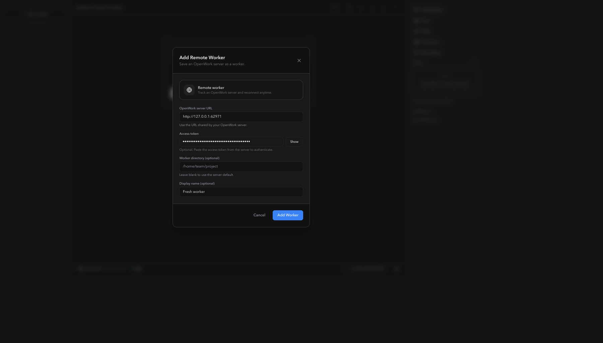
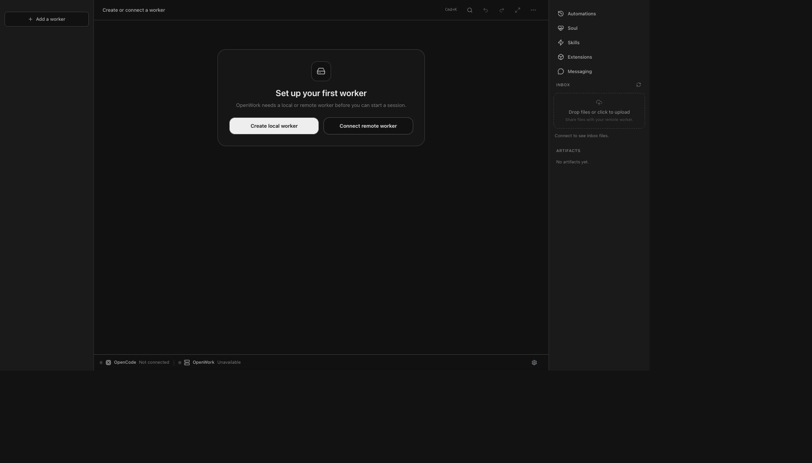
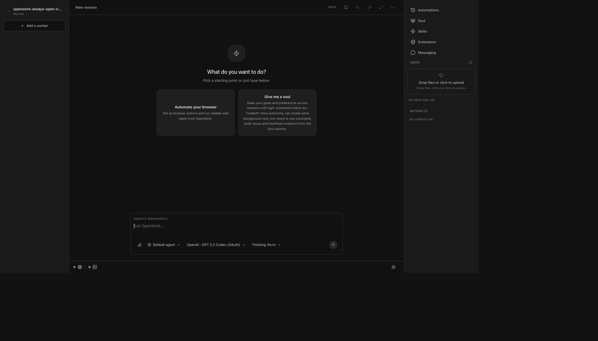

# Always Open New Session

## What changed

- App boot keeps the user on the draft-ready `/session` surface instead of forcing a concrete session selection.
- Creating or importing a worker now lands on the empty `New session` screen.
- Sandbox worker creation no longer auto-creates a session before the user sends the first prompt.
- Session idle events now refresh the session record so just-in-time session titles stay in sync after the first turn.

## Checks

- `pnpm --filter @different-ai/openwork-ui typecheck`
- `pnpm --filter @different-ai/openwork-ui build`

## Verification

- `packaging/docker/dev-up.sh` failed locally because the orchestrator container exited `137` during `pnpm install` inside Docker.
- Fallback verification used a local OpenCode + OpenWork server + Vite stack, then Chrome MCP to confirm the UI behavior end to end.

## Screenshots

### 1. App open lands on the empty session screen

### 2. New worker flow still starts from the worker connect modal

### 3. After adding the worker, OpenWork stays on `New session`

### 4. Reloading the app with that worker selected still opens `New session`

