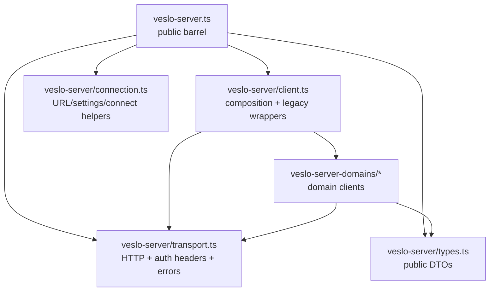
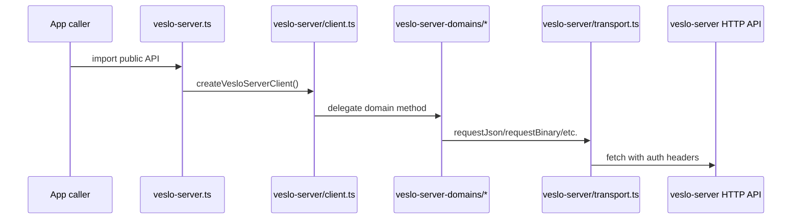

# Veslo Server Client Architecture

This file is an orientation map for the modularized Veslo server client. The old
`veslo-server.ts` used to hold most of the implementation. It is now a public
barrel, and the implementation is split by responsibility.

## Quick Orientation

- `veslo-server.ts` is the public import surface.
- `veslo-server/client.ts` builds `createVesloServerClient` and keeps legacy flat method wrappers.
- `veslo-server/transport.ts` owns HTTP transport, headers, timeouts, and `VesloServerError`.
- `veslo-server/connection.ts` owns URL, settings, connect invite, and bundle helpers.
- `veslo-server/types.ts` owns public DTOs, request types, and response types.
- `veslo-server-domains/*` owns domain-specific API clients.

## Architecture

## Old To New Map

| Old area in `veslo-server.ts` | New owner |
| --- | --- |
| `createVesloServerClient` | `veslo-server/client.ts` |
| flat compatibility methods | `veslo-server/client.ts` |
| request helpers and auth headers | `veslo-server/transport.ts` |
| `VesloServerError` | `veslo-server/transport.ts` |
| settings and URL helpers | `veslo-server/connection.ts` |
| connect invite and bundle helpers | `veslo-server/connection.ts` |
| DTOs, response types, input types | `veslo-server/types.ts` |
| workspace/status/config calls | `veslo-server-domains/workspace.ts` |
| skills, registry, materialization calls | `veslo-server-domains/skills.ts` |
| Soul calls | `veslo-server-domains/soul.ts` |
| conversation/session calls | `veslo-server-domains/conversations.ts` |
| file session, inbox, artifact calls | `veslo-server-domains/files.ts` |
| automations calls | `veslo-server-domains/automations.ts` |
| commands calls | `veslo-server-domains/commands.ts` |
| MCP calls | `veslo-server-domains/mcp.ts` |
| plugin calls | `veslo-server-domains/plugins.ts` |
| OpenCode Router identity calls | `veslo-server-domains/messaging-identities.ts` |
| read-only extension overview | `veslo-server-domains/extensions-inventory.ts` |

## Request Flow

## Domain Client Rules

- Keep `veslo-server.ts` as a barrel only.
- Add new endpoint calls to the matching `veslo-server-domains/*` module.
- Keep legacy flat methods in `veslo-server/client.ts` as compatibility wrappers.
- Import shared public types from `../veslo-server/types`, not from the public barrel.
- Use `workspacePath(workspaceId)` from `veslo-server-domains/path.ts` for `/workspace/:id` path segments.
- Keep aggregate read models client-side unless there is a clear server-side ownership reason.

## Server Route Counterparts

Most app domain clients mirror a server route adapter under `packages/server/src/routes`.

| App domain client | Server route adapter |
| --- | --- |
| `workspace.ts` | `routes/workspace-management.ts`, `routes/health.ts` |
| `skills.ts` | `routes/workspace-skills.ts`, `routes/skill-materialization.ts`, `routes/skill-registry.ts`, `routes/skill-removals.ts`, `routes/skill-enabled.ts`, `routes/user-global-skills.ts` |
| `soul.ts` | `routes/soul.ts` |
| `conversations.ts` | `routes/conversations.ts`, `routes/session-archives.ts` |
| `files.ts` | `routes/file-sessions.ts` |
| `automations.ts` | `routes/automations.ts`, `routes/scheduler.ts` |
| `commands.ts` | `routes/commands.ts` |
| `mcp.ts` | `routes/mcp.ts` |
| `plugins.ts` | `routes/plugins.ts` |
| `messaging-identities.ts` | `routes/opencode-router.ts` |

## Where To Start

- Need to call an existing endpoint? Start in the matching domain file.
- Need to add a new endpoint? Add the server route adapter first, then the app domain method.
- Need to preserve old app call sites? Add or update a flat wrapper in `veslo-server/client.ts`.
- Need a new shared response type? Add it to `veslo-server/types.ts`.
- Need to change request mechanics? Start in `veslo-server/transport.ts`.
